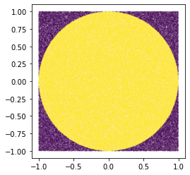

# Estimating Pi With Py


Using the [Monte Carlo method](https://en.wikipedia.org/wiki/Monte_Carlo_method) (repeated random sampling to estimate some numerical result) we can estimate the value of π. To make it more fun, I wrote the code to match the classic heuristic example: throwing darts at a dart board. 

### How does one estimate π with darts? 
Imagine we have a round dart board hung up on a wall, with a square backdrop no longer than the length of the round dart board. Suppose you were able to throw darts at this board such that the dart *always* landed within the square, whether or not on the dart board. 


Each time you throw a dart, you know whether or not it made it in on to the board.
If we throw *a lot* of darts, then we can **estimate the area of the dart board** by taking the proportion of darts that landed on the board divided by the total number of darts thrown. This estimate gets better as more darts are thrown. If we can **estimate the area of the circular board**, and we can measure the radius, then using the formula for the area of a circle, we can estimate π.
 
Instead of having to buy darts, we can have python throw them for us! I wrote a [small python script](https://github.com/jacksonrgwalker/pi-dart/blob/main/darts.py) that let's us play with darts (random points) on a board (the unit circle) with a backdrop (the unit square)


```python
import random
random.seed(42) #set seed to get determined results
```

We can create a dart, and throw it at the board. It will land in a random spot. 


```python
from darts import Dart

my_dart = Dart.throw() # throws the dart, lands in random spot on the unit square

my_dart
```


    Dart(x=0.2788535969157675, y=-0.9499784895546661)


```python
# distance from the origin to where the dart landed
my_dart.distance_from_origin() 
```


    0.9900598260354908


We can also make a lot of darts and throw them all at the same time...


```python
from darts import DartSet
```


```python
radius = 1 # unit circle
n = 250_000 # lots of darts!
```


```python
%%time 

random_points = DartSet.throw_all(n=n) # throw all the darts! 

# check if the dart landed in the unit circle
within_circle = [dist < radius for dist in random_points.distance_from_origin()] 

# adds up the number of true values, i.e. the ones in the unit circle
darts_in_circle = sum(within_circle) 
#total number of darts thrown (in or out of the circle)
total_darts = len(within_circle) 

# forms a 2x2 box (from -1 to 1 for x and y)
area_of_unit_square = 4 

# this estimates the unit circle area divided by the unit square area
circle_proportion_of_square = darts_in_circle / total_darts 

# we know the unit square area, leaving us with the area of the unit circle
area_of_unit_circle_estimate = circle_proportion_of_square * area_of_unit_square 
```

    Wall time: 549 ms
    

Since the area of circle with radius r is given by π*r^2 , our estimate for π is the just the area of the unit circle, where the radius is 1


```python
pi_estimate = area_of_unit_circle_estimate
print(f'The estimate for pi is {pi_estimate}')
```

    The estimate for pi is 3.140128
    

Here is a plot of all of our dart throws. The ones that landed on the board are yellow, the others are purple. 


```python
import matplotlib.pyplot as plt
plt.gca().set_aspect('equal', adjustable='box')
plt.scatter(random_points.x, random_points.y, c = within_circle, s=.005)
plt.show()
```


    

    


If we really wanted to speed things up, we can use library like `numpy`.


```python
import numpy as np
```


```python
%%time 

x, y = np.random.uniform(low=0, high=1, size=(2, n))

distance_from_origin = np.sqrt(np.square(x) + np.square(y))

in_unit_circle = distance_from_origin < 1

pi_estimate = in_unit_circle.sum() / len(in_unit_circle) * area_of_unit_square

print(f'The estimate for pi is {pi_estimate}')
```

    The estimate for pi is 3.144608
    Wall time: 5.98 ms
    

Wow! This is around 100x faster than my own vanilla implementation.
